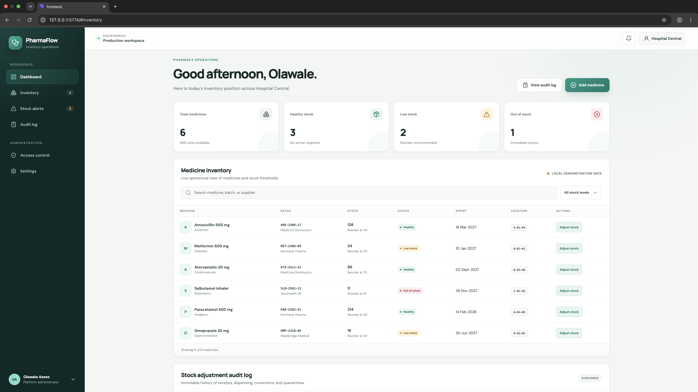
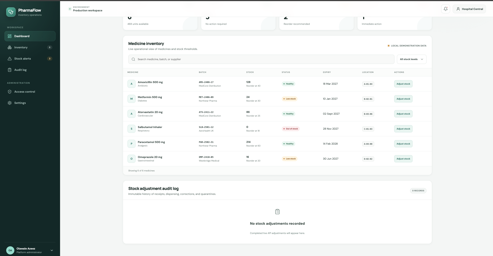
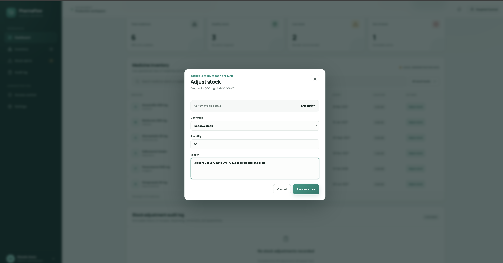
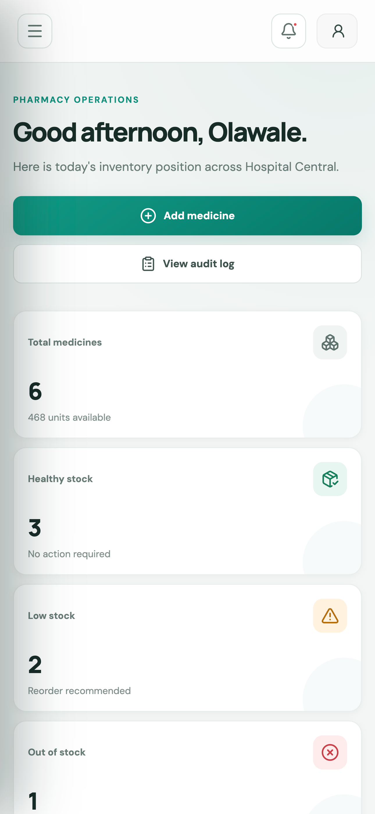
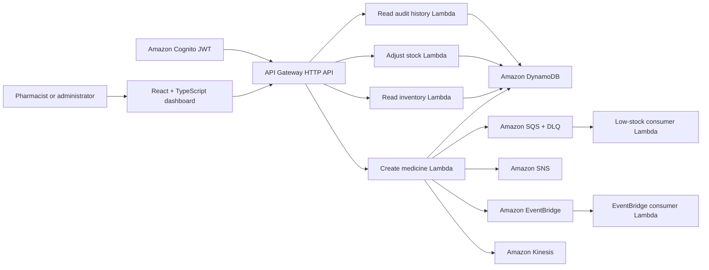

# PharmaFlow — Cloud-Native Pharmacy Inventory Platform

PharmaFlow is a multi-tenant pharmacy inventory platform built to demonstrate secure serverless APIs, tenant-isolated data, and event-driven stock workflows on AWS.

The repository contains a React operations dashboard, Python Lambda functions, AWS SAM infrastructure, automated tests, and CI/CD definitions. Pharmacists can view tenant-scoped inventory and add medicine batches. Creating a low-stock batch emits events for downstream alert processing.

> This is an engineering portfolio project, not a certified clinical system. It must not be used for real patient care or regulated pharmacy operations without the required security, compliance, validation, and operational controls.

## Product tour

The screenshots below use fictional demonstration inventory. Live audit history
and deployed AWS evidence will be added after the backend workflow is connected.

### Inventory management

Search, filter, and monitor medicine batches from the pharmacy operations
dashboard.



### Add medicine

Create a medicine batch with its supplier, quantity, reorder level, and expiry
date.



### Stock adjustments

Record receipts, dispensing, corrections, and quarantine operations with a
mandatory audit reason.



### Responsive mobile dashboard

The mobile layout keeps the most important stock information and actions
available on smaller screens.



## What the platform does

- Presents a responsive pharmacy inventory dashboard
- Reads inventory through a Cognito-protected HTTP API
- Creates tenant-scoped medicine batches
- Records stock receipts, dispensing, corrections, and quarantines
- Writes an immutable audit record atomically with every quantity change
- Calculates healthy, low-stock, and out-of-stock states
- Emits low-stock events through SQS, SNS, EventBridge, and Kinesis
- Processes SQS events with partial-batch failure reporting
- Stores inventory in a DynamoDB single-table model
- Deploys backend infrastructure with AWS SAM and CloudFormation
- Validates Python, TypeScript, infrastructure, and tests in GitHub Actions

## Architecture



Inventory records use tenant-scoped keys:

```text
PK = TENANT#{tenant_id}
SK = DRUG#{drug_id}
GSI1PK = TENANT#{tenant_id}#ENTITY#DRUG
```

The tenant identifier is obtained from verified JWT claims rather than request input.

## Technology

| Area | Technology |
| --- | --- |
| Frontend | React 19, TypeScript, Vite, Lucide React |
| API | API Gateway HTTP API, AWS Lambda, Python 3.12 |
| Data | Amazon DynamoDB |
| Identity | Amazon Cognito JWT authorizer |
| Events | Amazon SQS, SNS, EventBridge, Kinesis |
| Infrastructure | AWS SAM, CloudFormation |
| Delivery | GitHub Actions, CodeBuild, CodePipeline |
| Testing | Python `unittest`, ESLint, TypeScript, `cfn-lint` |

## Repository layout

```text
.
├── frontend/                              React dashboard
├── create_drug_lambda.py                  POST /drugs
├── get_drugs_lambda.py                    GET /drugs
├── adjust_stock_lambda.py                 POST /drugs/{drug_id}/adjustments
├── get_audit_log_lambda.py                GET /audit
├── process_low_stock_alert_lambda.py      SQS consumer
├── process_low_stock_eventbridge_lambda.py
├── template.yaml                          SAM application
├── pipeline-template.yaml                 AWS delivery pipeline
├── buildspec.yml                          CodeBuild validation/deploy steps
├── test_*.py                              Backend unit tests
├── LEARN.md                               Engineering learning journal
└── .github/workflows/validate.yml          Pull-request validation
```

## Run locally

### Prerequisites

- Python 3.12
- Node.js 22 and npm
- AWS SAM CLI for template build/deployment
- AWS credentials only when deploying or calling deployed services

### Backend tests

The unit tests mock AWS SDK clients and do not require AWS credentials.

```bash
python3 -m unittest discover --pattern "test_*.py" --verbose
```

### Frontend

```bash
cd frontend
npm ci
cp .env.example .env
npm run dev
```

`VITE_API_URL` must point to the deployed API Gateway stage. Live API calls also require a valid Cognito access token stored under `pharmaflow_access_token`. When either value is unavailable, the dashboard clearly identifies its local demonstration-data mode.

### Frontend validation

```bash
cd frontend
npm run lint
npm run build
```

## API contract

### `GET /drugs`

Requires a Cognito bearer token with one of these roles:

- `HospitalAdmin`
- `Pharmacist`
- `Viewer`

Returns tenant-scoped inventory:

```json
{
  "items": [
    {
      "id": "uuid",
      "drug_name": "Amoxicillin 500 mg",
      "batch_number": "AMX-2408-17",
      "quantity": 128,
      "reorder_level": 40,
      "expiry_date": "2027-03-18",
      "supplier": "MedCore Distribution",
      "category": "Uncategorised",
      "location": "Not assigned"
    }
  ],
  "count": 1
}
```

### `POST /drugs`

Requires the `HospitalAdmin` or `Pharmacist` role.

```json
{
  "drug_name": "Amoxicillin 500 mg",
  "batch_number": "AMX-2408-17",
  "quantity": 20,
  "reorder_level": 40,
  "expiry_date": "2027-03-18",
  "supplier": "MedCore Distribution"
}
```

Quantities must be non-negative whole numbers and the expiry date must be a future ISO date. When `quantity <= reorder_level`, low-stock events are published.

### `POST /drugs/{drug_id}/adjustments`

Requires the `HospitalAdmin` or `Pharmacist` role. The quantity update and audit record are committed in one DynamoDB transaction.

```json
{
  "adjustment_type": "RECEIPT",
  "quantity": 25,
  "reason": "Delivery note DN-1042 received and checked"
}
```

Supported operations:

- `RECEIPT` adds a positive quantity.
- `DISPENSE` subtracts a positive quantity.
- `QUARANTINE` removes a positive quantity from available stock.
- `CORRECTION` accepts a positive or negative quantity difference.

An adjustment that would make available stock negative returns `409 Conflict`.

### `GET /audit`

Returns the newest 100 tenant-scoped stock-adjustment records. `HospitalAdmin`, `Pharmacist`, and `Viewer` roles can read the history.

## Deploy to AWS

Validate before deploying:

```bash
sam validate --lint
sam build
```

Deploy interactively:

```bash
sam deploy --guided
```

The deployment requires:

- Cognito user-pool issuer URL
- Cognito app-client audience
- API stage name

Do not commit credentials or real access tokens. Use separate AWS accounts/stacks for development, staging, and production.

## Quality and security

The project currently includes least-privilege Lambda permissions, JWT route protection, DynamoDB encryption, X-Ray tracing, a low-stock DLQ, pinned CI validation tools, and partial-batch SQS failure handling.

Before production use, the platform still needs:

- Idempotent medicine creation and duplicate-batch protection
- Transactional/outbox-style event publishing
- API pagination and continuation tokens
- Restricted production CORS origins
- Managed frontend authentication and token refresh
- Complete audit history and stock-adjustment operations
- Alarms, dashboards, WAF/rate limiting, backups, and recovery testing
- Frontend component and end-to-end tests
- Regulatory, privacy, clinical-safety, and accessibility review

## Roadmap

- Stock recalls and release-from-quarantine workflows
- Expiry alerts and FEFO stock rotation
- Supplier and purchase-order workflows
- Inventory forecasting and operational analytics
- Notification preferences and escalation policies
- Screenshot gallery and hosted frontend demo
- Pagination, audit trails, observability, and disaster recovery

## Learning journal

See [LEARN.md](LEARN.md) for design decisions, lessons learned, validation commands, and the planned engineering sequence.

## Author

**Olawale Azeez**

Cloud Engineer | Platform Engineer | DevOps Engineer
